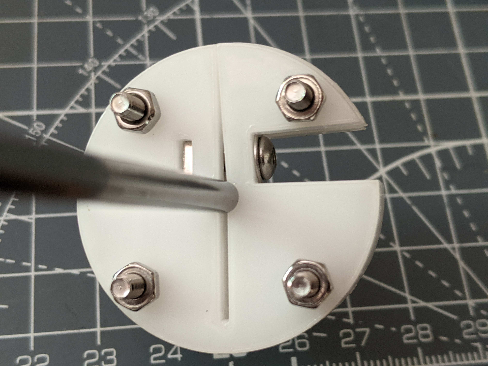

# lasercut-three-layer-hub

This is a simple hub for fitting lasercut parts (cogs & cams) to 4mm shafts.

It's designed to be lasercut from 3mm acetal. It might work in other materials but I have not tested it.

It uses M3 nuts & bolts, including one square M3 nut for the clamp bolt.

Note that the two top bolts (the ones near the clamp bolt) have to be loosened a bit 
while the clamp bolt is tightened, to allow the clamp action to happen. That's why those holes are oversize.

Assembly photos: https://photos.app.goo.gl/Y6nMeD6PPnjbo9gn7

The Fusion360 file in the design is moderately parametric, it should be easy to adjust
for other shaft and bolt diameters. DXFs are included for 4, 5,and 6mm shafts.

